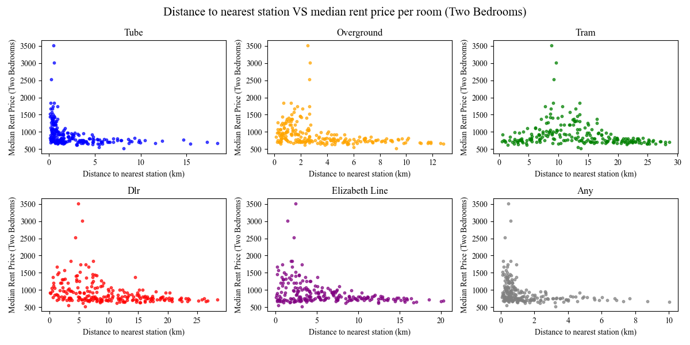
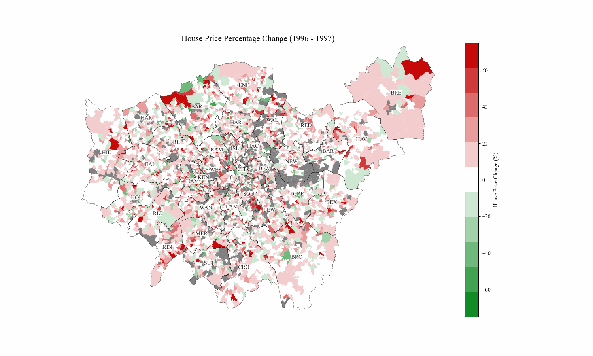

# The London Commuter's Dilemma: rent, transportation and demographic analysis
An interactive analysis of the rental and house prices across London compared to local transport and demographics.

Does distance to nearest transport links dictate local rental and house prices?

This analysis was focused on the Tube, Overground, DLR, Elizabeth line and Tram services. As shown above, the majority of the selected transport links are concentrated north of the river. Tram services are centred in Croydon while the DLR mainly spans parts of East London.


The median rent per room across London outcodes in 2023 ranged from £350 to £4000. As expected, rents increase closer to the city centre, with West London also showing slighter higher rent. The most expensive rents were for one-bedroom proprties in Westminster and Kensington and Chelsea, which aligns with the heavy concentration of tube stations in the area.

An outcode (HA9) in Wembley, Brent, consistently has higher rental prices than the surrounding areas. This is likely due to a shortage of rental properties in the area, allowing landlords to charge a premium. [https://www.brent.gov.uk/housing/renting-in-the-private-sector/find-a-place-you-can-afford]

Rent per room also decreases as the total number of rooms increases. The most notable drop is between one-bedroom flats and two-bedroom flats, for example where the median rent per room in Westminster decreased by 33%. Parts of London see a slight increase in rent between three-bed flats and four-or-more-bed properties. This could possibly be reflecting the type of property being rented out since three-bed properties are predominantly flats, whereas four-or-more-bed properties could be referring to houses. Due to the large upfront cost of buying a house instead of a flat, landlords may charge more to rent out houses leading to this spike in the maps.


Plotting the distance from the centre of each outcode to the nearest station against the median rent per room shows a small correlation. There is a premium for properties within 500m of a tube station, after which rents sharply drop. This pattern is most apparent in two-bedroom properties. Flats within 5km of the Elizabeth line also have a premium, likely be due to the overlap with the tube network.


The Spearman correlation between commute time to the centre of London and median rent per room is highest for one-bedroom flats followed by two-bedroom flats. This suggests that individuals living alone place a higher premium on accessibility, prioritising shorter commutes to offices. In contrast, those sharing larger houses may be more willing to tolerate longer travel times in exchange for lower rent. This pattern also highlights the distribution of employment, with single occupants being more likely to work in Central London while individuals living in shared accomodation have to compromise on location to find a place that offers a reasonable commute for each household member.


A value score that combines rent affordability and ease of commute, shows that areas in East and Southeast London (Hackney, Newham, Bexley) provide the best trade-off. They provide cheaper rents (around £550 per room) along with short commute times around 30 minutes. Ealing is also noteworthy, likely due to the Elizabeth line. On the other hand, Central and West London (Camden, Kensington and Chelsea) have the worst trade-off, with rent prices around £3500 per room, outweighing the shorter commute time. This shows that the areas with the best 'value' are not the central locations but those adjacent to the centre.

As shown by the maps, the value scores of all areas increase as the total number of bedrooms within the property increase. This is due to the median rent per room decreasing with total number of rooms. The most notable jump is between one-bedroom flats in Westminster and Kensington and Chelsea to two-bedroom flats.


House prices across London display a different spatial pattern to rental prices. Rental prices are primarily dictated by distance from the city centre while house prices seem to have other contributing factors. Boroughs such as Barnet, Camden, Westminster, Kensington and Chelsea, Hammersmith, Richmond, Wandsworth, and Merton, some of Londons's more affluent neighbourhoods, are highlighted by red on the maps. These areas are considered more desirable due to their access to ammenities such as large green spaces, numerous recreational venues, and historical architecture.

One reason for the divergence in patterns is the differing demographics of renters and buyers. Most renters are young working professionals who cannot afford to buy houses and often prefer the flexibility of short-term accomodation should they decide to relocate. They prioritise proximity to employment centres over neighbourhood characteristics such as the architecture and number of local parks. Home-buyers on the other hand may wish to invest in affluent areas where since purchasing a property is more permanent and therefore such neighbourhoods offer a certain lifestyle and long-term investment value.

Additionally, rental prices are constrained by affordability limits, meaning landlords cannot increase prices past what renters are willing to pay. This cap prevents extreme rental prices seen in house prices across London, even in the highly desireable areas.





## Data
Housing data was provided by ONS:

rental data = https://www.ons.gov.uk/file?uri=/economy/inflationandpriceindices/adhocs/2052privaterentalmarketinlondonapril2023tomarch2024

house prices data = https://www.ons.gov.uk/file?uri=/peoplepopulationandcommunity/housing/datasets/medianpricepaidbylowerlayersuperoutputareahpssadataset46/current

age and sex data = https://www.ons.gov.uk/file?uri=/peoplepopulationandcommunity/populationandmigration/populationestimates/datasets/lowersuperoutputareamidyearpopulationestimates/mid2021andmid2022

Transport data was collected by the TfL API.


## Installation and Setup
1. **Clone and activate**
```bash
git clone https://github.com/Shwasa/london_housing_transport.git
cd london_housing_transport
.geo_env\Scripts\activate #Windows
# source env/bin/activate  #Linux/Mac
```
2. **Ready environment**
```bash
pip install -r requirements.txt
```
3. **Download and process data**
```bash
python scripts/01_download_data.py #approximately 3 minutes
python scripts/02_process_data.py #approximately 5 minutes
python scripts/03_download_commute_time_data.py #approximately 15 minutes
```
4. **Explore notebooks**
```bash
jupyter notebook notebooks/01_rental_analysis.ipynb
jupyter notebook notebooks/02_house_prices_analysis.ipynb
```