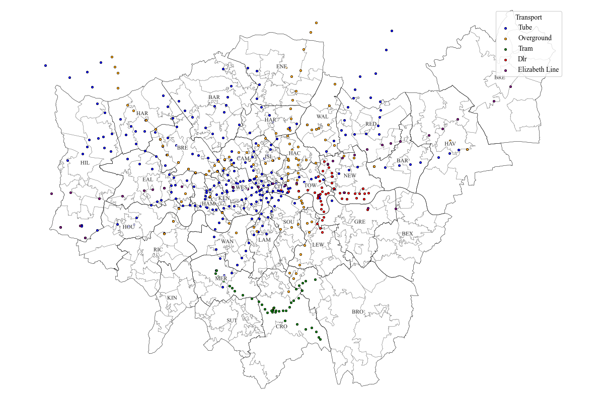
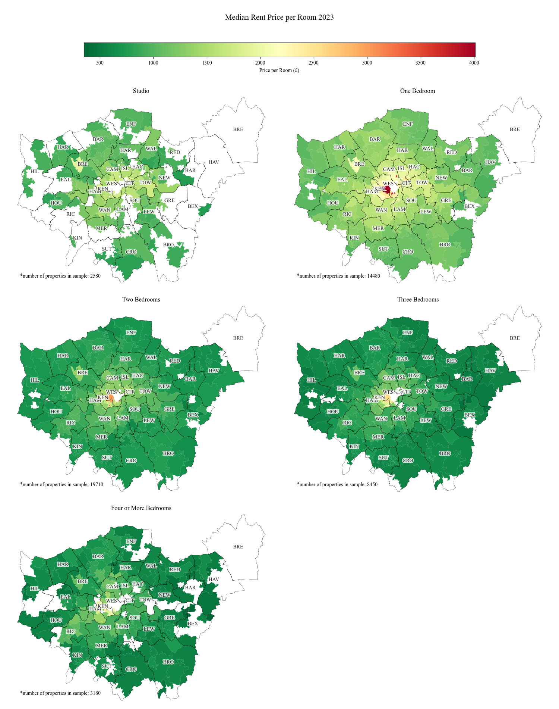
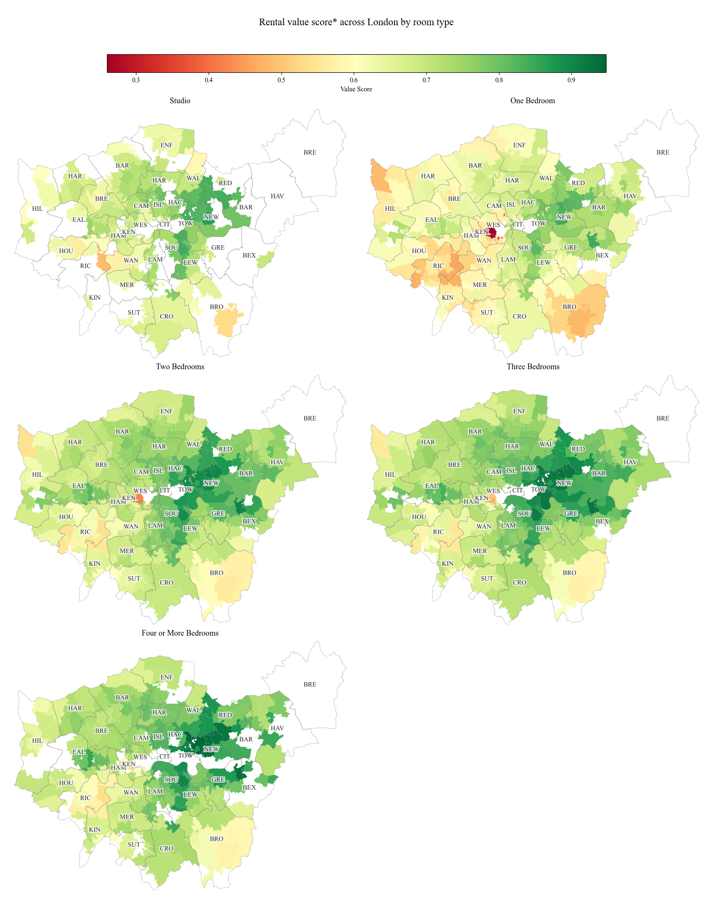
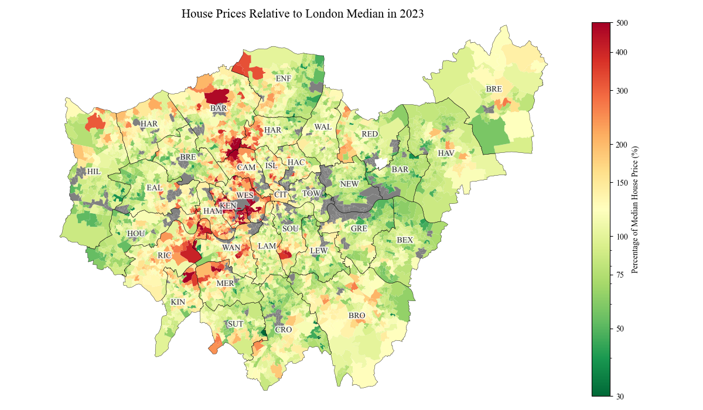
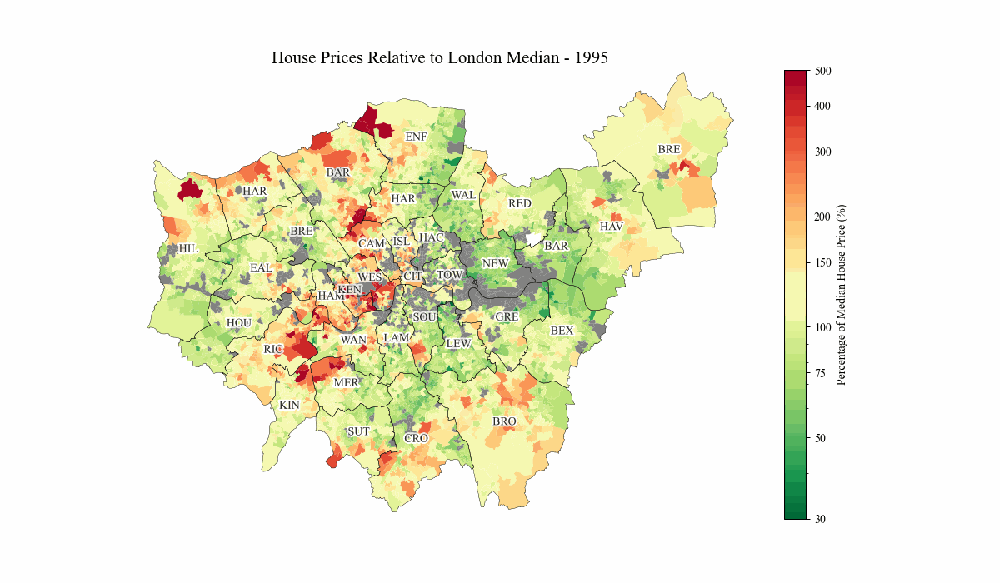

# The London Commuter's Dilemma: rent, transportation and demographic analysis
An interactive analysis of the rental and house prices across London compared to local transport and demographics.

Does distance to nearest transport links dictate local rental and house prices?

This analysis was focused on the tube, overground, dlr, elizabeth line and tram services. As shown above, the majority of the selected transport links are concentrated north of the river. Tram services are centred in Croydon while the DLR mainly spans parts of East London.


The median rent per room across London outcodes in 2023 ranged from £350 to £4000. As expected, the closer to the centre of the city, the more expensive the rent. West London also shows slightly higher prices compared to the rest of London. The most expensive rent prices were one-bedroom proprties in Westminster and Kensington and Chelsea which aligns with the heavy concentration of tube stations in the area. An outcode (HA9) in Wembley, Brent consistently has higher rental prices than the surrounding area. This is supposedly due to the shortage of rental properties in the area, meaning landlords can take advantage of the monopoly and hike up prices.

Rent prices per room also decreases as total number of rooms increase. The most notable jump is between one-bedroom flats and two-bedroom flats where for example the median rent per room in Westminster decreased by 33%. Prices in parts of London increased between three-bed flats and four-or-more-bed properties. This could be due to the type of property as three-bed properties could mainly include apartments compared to four-or-more-bed properties referring to houses. Due to the large upfront cost of buying a house instead of a flat, landlords may charge more to rent out houses leading to this spike in the maps.








## Data
Housing data was provided by ONS:
rental data = https://www.ons.gov.uk/file?uri=/economy/inflationandpriceindices/adhocs/2052privaterentalmarketinlondonapril2023tomarch2024
house prices data = https://www.ons.gov.uk/file?uri=/peoplepopulationandcommunity/housing/datasets/medianpricepaidbylowerlayersuperoutputareahpssadataset46/current
age and sex data = https://www.ons.gov.uk/file?uri=/peoplepopulationandcommunity/populationandmigration/populationestimates/datasets/lowersuperoutputareamidyearpopulationestimates/mid2021andmid2022

Transport data was collected by the TfL API.


## Installation and Setup
1. **Clone and activate**
```bash
git clone https://github.com/Shwasa/london_housing_transport.git
cd london_housing_transport
.geo_env\Scripts\activate #Windows
# source env/bin/activate  #Linux/Mac
```
2. **Ready environment**
```bash
pip install -r requirements.txt
```
3. **Download and process data**
```bash
python scripts/01_download_data.py #approximately 3 minutes
python scripts/02_process_data.py #approximately 5 minutes
python scripts/03_download_commute_time_data.py #approximately 15 minutes
```
4. **Explore notebooks**
```bash
jupyter notebook notebooks/01_rental_analysis.ipynb
jupyter notebook notebooks/02_house_prices_analysis.ipynb
```