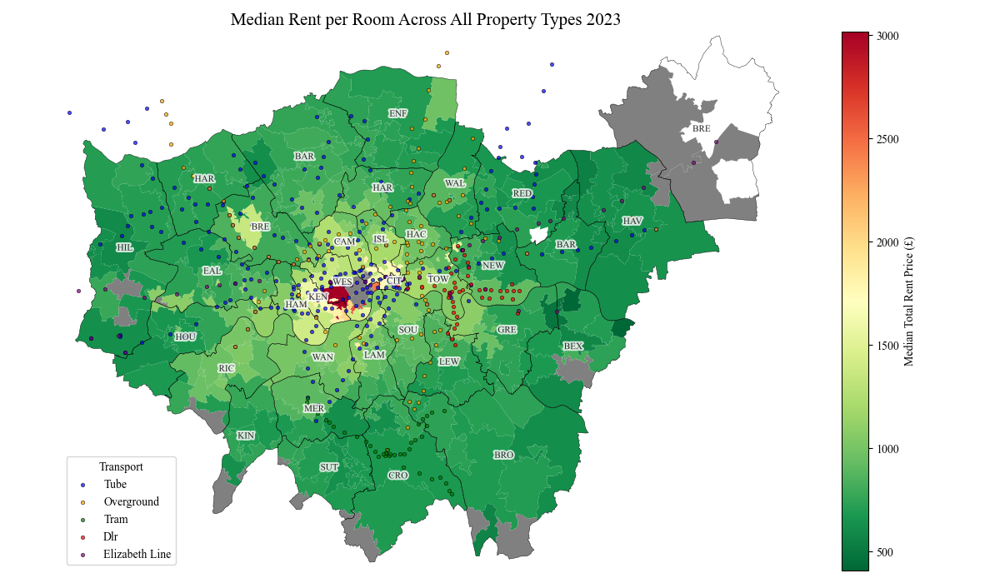
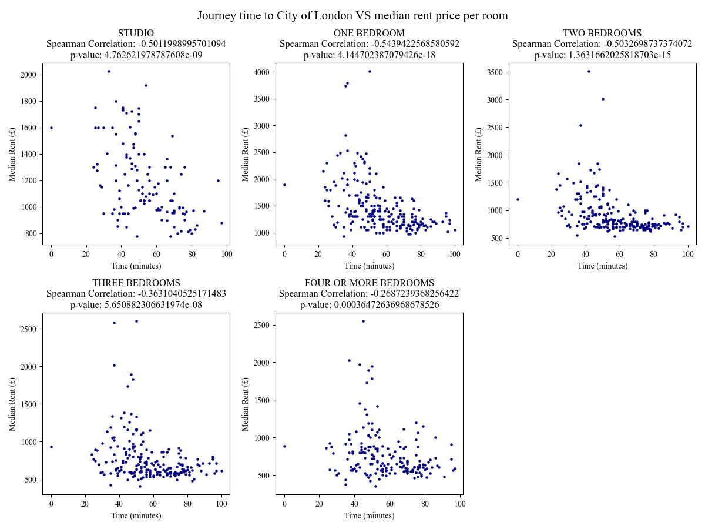

# The London Commuter's Dilemma: rent, transportation and demographic analysis
An interactive analysis of the rental and house prices across London compared to local transport and demographics.

This project analyses the link between transport and rental prices in London to find which areas provide the best balance between affordable rent and reasonable commute times.

## Key Insights

### Rental Market Patterns
- The median rent per room in London in 2023 ranged from **£350** to **£4010**.
- Highest rents were in Westminster, Kensington & Chelsea, and Camden for one-bedrooms.
- Lowest rents were in Bexley and Havering for four-or-more bedrooms.
- Outcode HA9 in Wembley consistently shows higher prices due to a shortage of rental properties.

### Transport Premium Analysis
- The Elizabeth line commands the highest premium with around £521 a month within 0.5km-1km.
- The tube offers the 2nd highest premium of £481 a month within 100m-200m.
- Noise impact could be reason for Elizabeth line premium peak further away compared to tube.
- Premiums decrease significantly after 500m from stations.

### Commute VS Rent Trade-offs
- One-bed flats show highest correlation with commute times (though minimal).
- Suggests single occupants prioritise shorter commutes and shared households prioritise affordability.
- Best value areas: **East** or **Southeast London** (Hackney, Newham, Bexley) offer optimal balance.

### Key Visuals







## Data
Housing data was provided by ONS:

rental data = https://www.ons.gov.uk/file?uri=/economy/inflationandpriceindices/adhocs/2052privaterentalmarketinlondonapril2023tomarch2024

house prices data = https://www.ons.gov.uk/file?uri=/peoplepopulationandcommunity/housing/datasets/medianpricepaidbylowerlayersuperoutputareahpssadataset46/current

age and sex data = https://www.ons.gov.uk/file?uri=/peoplepopulationandcommunity/populationandmigration/populationestimates/datasets/lowersuperoutputareamidyearpopulationestimates/mid2021andmid2022

Transport data was collected by the TfL API.


## Installation and Setup
1. **Clone and activate**
```bash
git clone https://github.com/Shwasa/london_housing_transport.git
cd london_housing_transport
.geo_env\Scripts\activate #Windows
# source env/bin/activate  #Linux/Mac
```
2. **Ready environment**
```bash
pip install -r requirements.txt
```
3. **Download and process data**
```bash
python scripts/01_download_data.py #approximately 3 minutes
python scripts/02_process_data.py #approximately 5 minutes
python scripts/03_download_commute_time_data.py #approximately 15 minutes
```
4. **Explore notebooks**
```bash
jupyter notebook notebooks/01_rental_analysis.ipynb
jupyter notebook notebooks/02_house_prices_analysis.ipynb
```