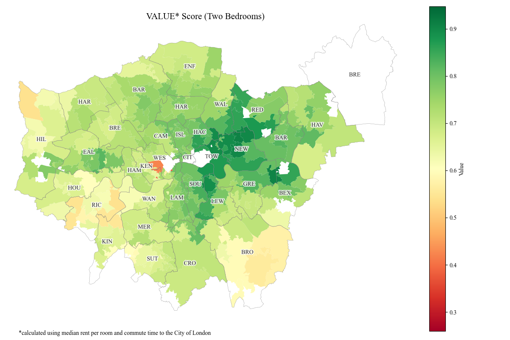

# The London Commuter's Dilemma: rent, transportation and demographic analysis
An interactive analysis of the rental and house prices across London compared to local transport and demographics.




## Installation and Setup
1. **Clone and activate**
```bash
git clone https://github.com/Shwasa/london_housing_transport.git
cd london_housing_transport
.geo_env\Scripts\activate #Windows
# source env/bin/activate  #Linux/Mac
```
2. **Ready environment**
```bash
pip install -r requirements.txt
```
3. **Download and process data**
```bash
python scripts/01_download_data.py #approximately 3 minutes
python scripts/02_process_data.py #approximately 5 minutes
python scripts/03_download_commute_time_data.py #approximately 15 minutes
```
4. **Explore notebooks**
```bash
jupyter notebook notebooks/01_rental_analysis.ipynb
jupyter notebook notebooks/02_house_prices_analysis.ipynb
```